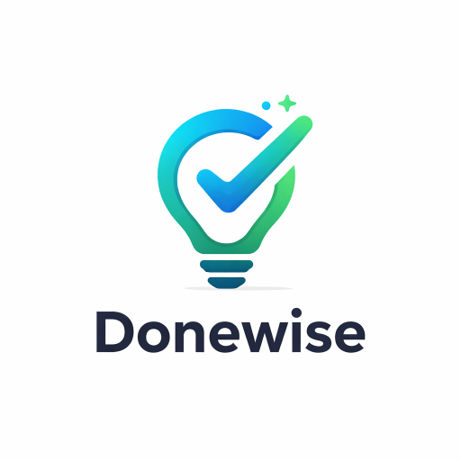

# Donewise - Collaborative Shopping List & Task Manager

**Donewise** is a robust, self-hosted web application designed to simplify household management. It combines a shared shopping list, daily task planner, and chore tracker into a clean, mobile-friendly interface.

Built with **PHP** and **SQLite**, Donewise is lightweight, privacy-focused, and easy to deploy using Docker.



## ✨ Features

### Core Functionality
* **Daily Task Lists:** Navigate between days to plan ahead or review past tasks.
* **Real-time Collaboration:** Lists update instantly across all devices using Server-Sent Events (SSE).
* **Smart Input:**
    * **Tags:** Organize items with hashtags (e.g., `Buy Milk #grocery`).
    * **Mentions:** Assign tasks to family members using `@username`.
* **Drag & Drop:** Reorder tasks and tags to prioritize what matters most.

### Organization & Details
* **Recurring Tasks:** Set items to repeat automatically every X days (e.g., "Water plants") or on specific days of the week (e.g., "Take out trash" every Thursday).
* **Rich Task Details:** Click any task to:
    * Add **Comments** for extra context.
    * Upload **Attachments** (images, PDFs) directly to the task.
    * View **History** of changes.
    * **Move** the task to a different date.

### Group Management
* **Multiple Groups:** Create separate spaces for "Home", "Work", or "Trip Planning".
* **Invite System:** Generate secure invite links to easily add members.
* **Member Roles:** Group creators can manage members (kick users) and transfer ownership.
* **Notifications:** See who joined, left, or updated critical items.

### Mobile & UI
* **Progressive Web App (PWA):** Installable on iOS and Android for a native app experience.
* **Dark Mode:** Automatically respects your device's theme settings.
* **Context Switching:** Quickly switch between different groups via the user menu.

---

## 🛠 Prerequisites

* **Docker** and **Docker Compose** installed on your machine.
* *(Optional)* A reverse proxy (Nginx, Traefik, or Nginx Proxy Manager) for SSL/HTTPS access.

---

## 🚀 Installation Guide

### 1. Clone & Setup
Create a directory for your project and place the source code inside. Your structure should look like this:

```text
/donewise
  ├── api/
  ├── app/
  ├── assets/
  ├── data/          <-- Created automatically
  ├── sql/
  ├── uploads/       <-- Created automatically
  ├── docker-compose.yml
  └── ... (PHP files)

```

### 2. Configure Environment

Edit `docker-compose.yml` to match your environment.

| Variable | Default | Description |
| --- | --- | --- |
| `APP_URL` | `http://localhost:8088` | **Crucial:** Set this to your actual access URL. Used for invite links. |
| `PHP_TZ` | `Asia/Kolkata` | Set to your timezone (e.g., `America/New_York`) for accurate task dates. |

### 3. Build & Run

Open a terminal in your project folder and run:

```bash
docker compose up -d --build

```

### 4. Fix Permissions (Important)

SQLite and the upload system need write access. Run these commands to fix permissions inside the container:

```bash
# 1. Allow web server to write to the database folder
docker exec -it Donewise chown -R www-data:www-data /var/www/html/data
docker exec -it Donewise chmod -R 775 /var/www/html/data

# 2. Allow web server to write to the uploads folder
docker exec -it Donewise mkdir -p /var/www/html/uploads
docker exec -it Donewise chown -R www-data:www-data /var/www/html/uploads
docker exec -it Donewise chmod -R 775 /var/www/html/uploads

```

---

## 📦 Database Setup & Updates

Use the built-in scripts to initialize and upgrade your database schema.

### 1. Initial Install

Open your browser and visit:

`http://localhost:8088/install.php`

*(You should see a "✅ Installed" message).*

### 2. Apply Feature Updates

To enable all latest features (Recurring tasks, Attachments, Tags, etc.), **visit the following URLs in order**. Even if you are installing fresh, run these to ensure the schema is complete.

1. `http://localhost:8088/update_db_v4.php` (Group Owners)
2. `http://localhost:8088/update_db_v5.php` (Tags)
3. `http://localhost:8088/update_db_v6.php` (Attachments)
4. `http://localhost:8088/update_db_v7.php` (Schema Patches)
5. `http://localhost:8088/update_db_v8.php` (Schema Patches)
6. `http://localhost:8088/update_db_v9.php` (Latest Schema)
7. `http://localhost:8088/update_recurring.php` (Recurring Logic)

> **Security Tip:** After setup, delete `install.php` and the `update_*.php` files from the server:
> ```bash
> docker exec -it Donewise rm /var/www/html/install.php
> 
> ```
> 
> 

---

## 📖 Usage Guide

### Getting Started

1. Go to `http://localhost:8088/register.php`.
2. Create your first Group (e.g., "Home").
3. You are now the **Group Owner**.

### Managing Tasks

* **Add:** Type in the main input. Use `#` for tags (e.g., `#urgent`) and `@` to assign users.
* **Edit:** Click the **pencil icon** to rename or tap the task text to open **Task Details**.
* **Details View:** Inside Task Details, you can upload photos (receipts, screenshots) or chat about the task in the comments.
* **Move:** Need to delay a task? Open details and select a new date.

### Recurring Items

1. Click **Recurring** in the top navigation.
2. Create rules like "Pay Internet Bill" every "28 Days".
3. Donewise automatically checks these rules when you visit the app and adds the task to "Today" if it's due.

### Group Settings

1. Click **Group** in the header.
2. **Invite:** Copy the Invite Link and send it to others.
3. **Manage:** Rename the group, manage custom tags (change colors/delete), or remove members.

---

## ❓ Troubleshooting

**"General error: 14 unable to open database file"**

* The web server (www-data) cannot write to the `data/` folder. Re-run the permission commands in Step 4 of Installation.

**Images or Attachments fail to upload**

* Ensure the `uploads/` folder exists and has write permissions.
* Check that your file is within the PHP upload limit (default 20MB in the Dockerfile).

**@Mentions list is cut off**

* This is a known display issue on smaller screens if the group has many members. It is resolved in the latest CSS update by adding a scrollbar to the dropdown.

**Dates/Times are incorrect**

* Check the `PHP_TZ` variable in your `docker-compose.yml`. You must restart the container after changing this: `docker compose down && docker compose up -d`.